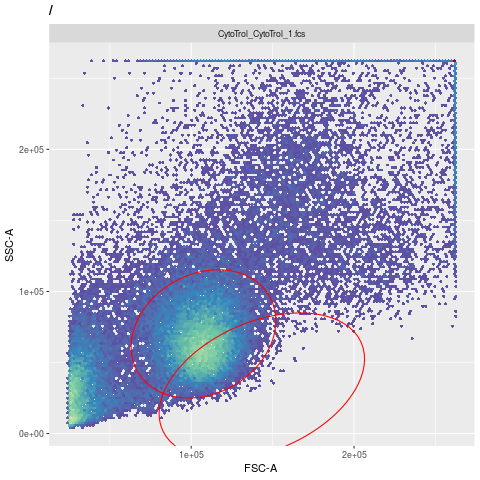

# cytoml_bug_flowjo_ellipse

Reproducible example of CytoML issue with flowJo ellipses 

Ellipses coordinates obtained after parsing the flowJo workspace file are not correct in the gating set. 

The ellipses are not placed correctly (coordinates are closed to zero) which results in no OpenCyto counts. The code works in R_3.6.1 (a bit old) but no more in 4.2.1 and CytoML **2.9.0** (2022-04-26 [1] Bioconductor)

# How to reproduce

* clone the project
* make build run
* examine/run code in: **flowjo_ellipse_bug.R**

# Description

Two ellipses were defined in the **cytotrol.wsp** flowJo workspace using flowJo 10.8.1 with the **CytoTrol_CytoTrol_1.fcs** file.

These ellipses should be located here
* fromflowJo

* R3.61

* but are misplaced near the origin (0,0) and mostly invisible using the last bioc:devel CytoML version.

